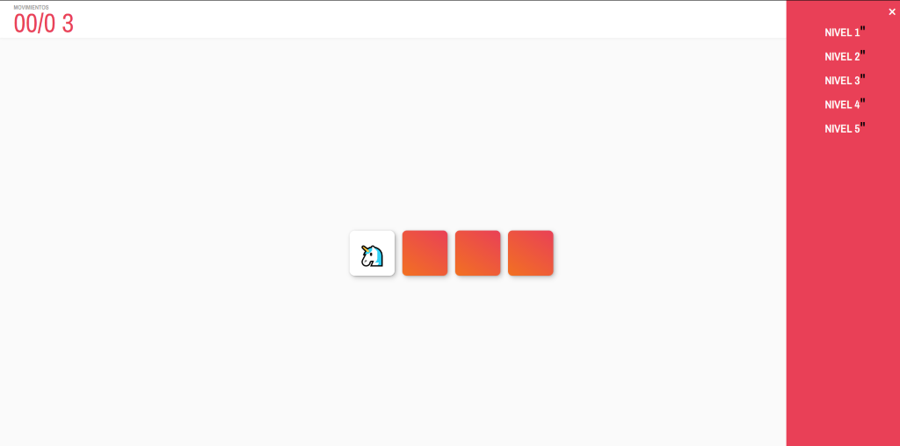
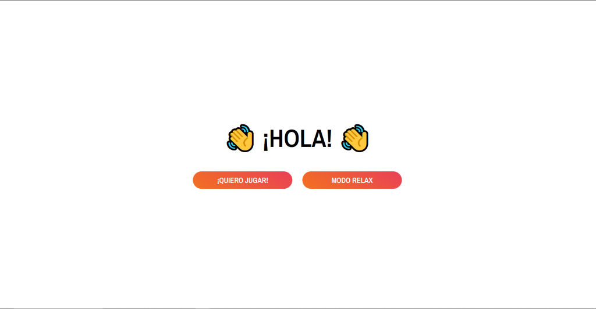
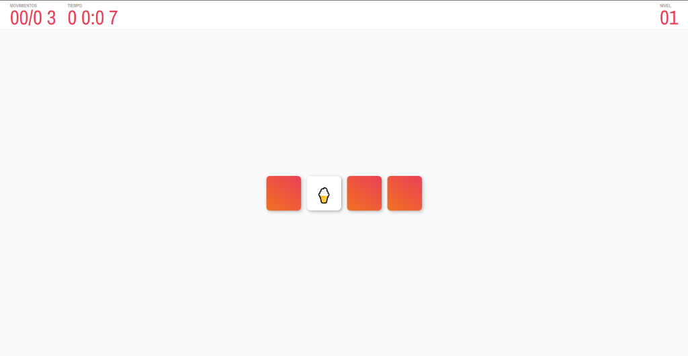
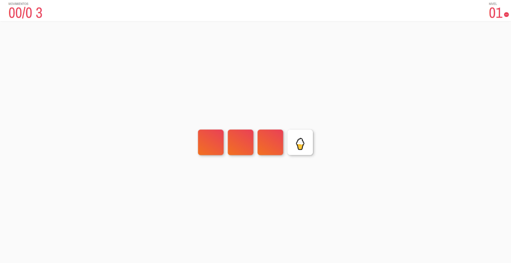

# PreeEntrega Nº 2: Integrar el DOM y eventos

## Juego de Memoria

## Descripción del Proyecto

Este proyecto consiste en un juego de memoria desarrollado con HTML, CSS y JavaScript. El objetivo del juego es encontrar las parejas de tarjetas iguales dentro de un conjunto de tarjetas barajadas en la mesa. El jugador puede descubrir dos tarjetas a la vez y debe recordar la ubicación de las tarjetas para hacer coincidir las parejas.

El juego cuenta con diferentes niveles de dificultad, cada uno con un número limitado de movimientos para completar el nivel. Además, se puede jugar en modo "relax" sin límite de tiempo o en modo normal con un cronómetro que marca el tiempo restante para completar el nivel.

## Captura de Pantalla

Pantalla de Inicio

Modo Quiero Jugar

Modo relax

## Instalación y Uso

1. Clona este repositorio en tu máquina local.
2. Abre el archivo `index.html` en tu navegador web.
3. Selecciona el nivel de dificultad y comienza a jugar.

## Funcionalidades

- Descubre tarjetas y encuentra parejas iguales.
- Controla el número de movimientos permitidos por nivel.
- Cronómetro para medir el tiempo de juego en modo normal.
- Menú de selección de niveles para elegir la dificultad del juego.
- Pantallas de Game Over y Time Over cuando se exceden los límites de movimientos o tiempo.

## Tecnologías Utilizadas

- HTML
- CSS
- JavaScript

## Créditos

Este proyecto fue desarrollado por Carlos Andres Alzate.

## Licencia

Este proyecto está bajo la Licencia MIT - consulta el archivo [LICENSE](LICENSE) para más detalles.
